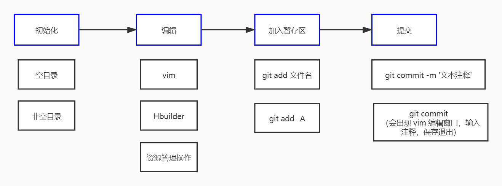
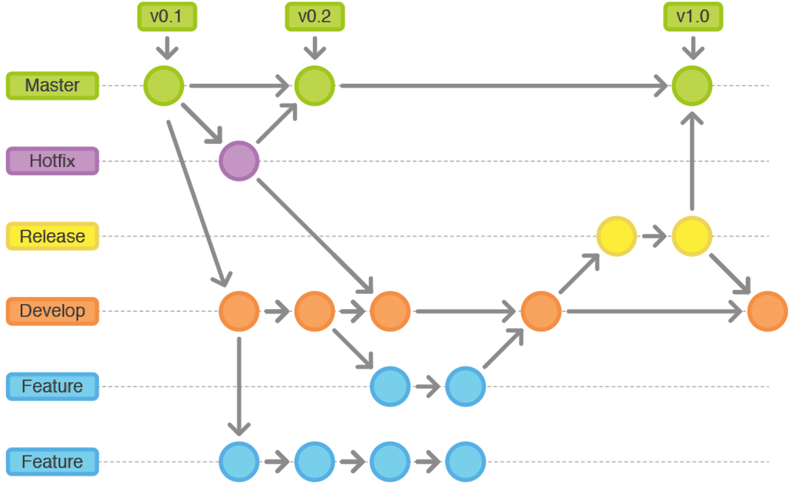

# Git

**Git** 是一款开源免费的分布式的版本控制系统，是一个应用程序.

版本控制系统在项目开发中作用重大，主要的功能有以下几点:

- 代码备份
- 版本回退
- 协作开发
- 权限控制

## 起始配置

第一次使用 Git 的时候，会要求我们配置用户名和邮箱，用于表示开发者的信息, 注意命令之间的空格

- `git config --global user.name "Your Name"`
- `git config --global user.email "email@example.com" `

可以使用 `git config -l` 命令来查看配置信息

## 基本操作

1. 创建并进入空文件夹
2. 右键 => 点击 Git Bash Here 启动命令行
3. `git init` 仓库初始化
4. 创建一个初始化文件 index.html
5. `git add index.html` 将文件加入到暂存区
6. `git commit -m '注释'` 提交到仓库 m 是 message 单词的缩写
   

## .git 目录信息

- hooks 目录包含客户端或服务端的钩子脚本，在特定操作下自动执行
- info 信息文件夹. 包含一个全局性排除文件，可以配置文件忽略
- logs 保存日志信息
- objects 目录存储所有数据内容，本地的版本库存放位置
- refs 目录存储指向数据的提交对象的指针（分支）
- config 文件包含项目特有的配置选项
- description 用来显示对仓库的描述信息
- HEAD 文件指示目前被检出的分支
- index 暂存区文件，是一个二进制文件 (git ls-files)

:::danger 切记

不要手动去修改 .git 文件夹中的内容

:::

## 版本库的三个区域

- 工作区（代码编辑区）
- 暂存区（修改待提交区）
- 仓库区（代码保存区）

## 常用命令

1. `git init` 仓库初始化
2. `git add -A` 添加所有新文件到暂存区，添加的是修改，而不是文件
3. `git commit -m '注释'` 提交修改并注释
4. `git status` 版本状态查看，如果显示的是红色修改，表明此修改只存在于工作区。如果显示的是绿色修改，表明此修改只存在于工作区和暂存区
5. `git diff` 查看工作区与暂存区的差异（不显示新增文件）显示做了哪些修改
6. `git diff --cached` 查看暂存区与仓库的差异
7. `git ls-files` 查看暂存区的文件内容
8. `git clone` 克隆仓库
9. `git pull` 拉取指定仓库的指定分支 `git pull origin master`
10. `git branch` 查看分支
    - `git branch name` 创建
    - `git branch -d name` 删除分支
    - `git merge name` 分支合并
    - `git checkout name` 切换分支
    - `git checkout -b name` 创建并切换
11. `git remote` 远程仓库别名管理
    - `add` 新增别名
    - `remove` 移除别名
    - `rename` 重命名别名
12. `git push` 将本地仓库的『分支』推送到远端仓库
    - `git push -u origin master`
    - `git push dev master`
    - `git push dev master:main`

## 历史版本回滚

查看历史记录

- `git log` 或 `git log --oneline`
- 如果内容偏多，需要使用方向键上下滚动，按q退出

根据版本号进行回滚

- `git reset --hard b98cff07d643fb81036b3df15e289aa595844e80`
- 进行版本回退时，不需要使用完整的哈希字符串，前七位即可
- 版本切换之前，要提交当前的代码状态到仓库

找不到版本号的情况

- 查看所有操作记录
- `git reflog`

## 配置忽略文件

#### 仓库中没有提交该文件

项目中有些文件不应该存储到版本库中，Git 中需要创建一个文件 `.gitignore` 配置忽略，一般与 .git 目录同级。

常见情况有：

1. 临时文件
2. 多媒体文件，如音频、视频。
3. 编辑器生成的配置文件（.idea）
4. npm 安装的第三方模块
    ```
   # 忽略所有的 .idea 文件夹
   .idea
   # 忽略所有以 .test 结尾的文件
   *.test
   # 忽略 node_modules 文件和文件夹
   /node_modules
   ```

`.gitignore` 可以在子文件夹下创建

#### 仓库中已经提交该文件

对于已经加入到版本库的文件，可以在版本库中删除该文件 `git rm --cached .idea`

然后在 `.gitignore` 中配置忽略, add和commit提交即可

如果 `.gitignore` 创建失败, 可以使用『编辑器』或者『命令行』方式创建

git 会默认忽略空文件夹

## 分支

分支是 Git 重要的功能特性之一，开发人员可以在主开发线的基础上分离出新的开发线。branch

基本操作

- 创建分支 `git branch name` name 为分支的名称

- 查看分支 `git branch`

- 切换分支 `git checkout name`

- 合并分支 `git merge name`

- 删除分支 `git branch -d name`

- 创建并切换分支 `git checkout -b name`

- 注意：每次在切换分支前，提交以下当前分支

## 冲突

当多个分支修改同一个文件后，合并分支的时候就会产生冲突。冲突的解决非常简单，『将内容修改为最终想要的结果』，然后继续执行 git add 与 git commit 就可以了。

1. `git status` 定位有冲突的文件
2. 修改冲突文件的内容，为最终正确的样子
3. `git add` 和 `git commit`

## GitFlow

**GitFlow** 是团队开发的一种最佳实践，将代码划分为以下几个分支


- **`Master`** 主分支。上面只保存正式发布的版本
- **`Hotfix`** 线上代码 Bug 修复分支。开发完后需要合并回Master和Develop分支，同时在Master上打一个tag
- **`Feather`** 功能分支。当开发某个功能时，创建一个单独的分支，开发完毕后再合并到 dev 分支
- **`Release`** 分支。待发布分支，Release分支基于Develop分支创建，在这个Release分支上测试，修改Bug
- **`Develop`** 开发分支。开发者都在这个分支上提交代码

:::tip 首次克隆完代码后，需要切换到开发分支
```
//查看所有分支
git branch -a
//切换分支
git checkout dev
```
:::
