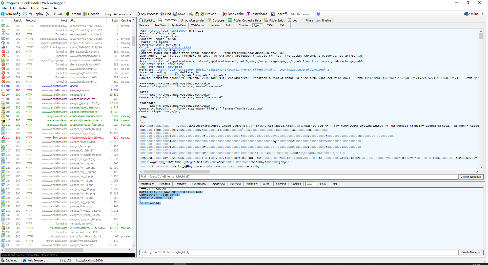

# HTTP 协议

HTTP（hypertext transport protocol）协议也叫 **超文本传输协议**，是一种基于 TCP/IP 的应用层通信协议，这个协议详细规定了浏览器和万维网服务器之间互相通信的规则。

协议主要规定了两方面的内容

* 客户端向服务器发送数据，称之为 **请求报文**
* 服务器向客户端返回数据，称之为 **响应报文**

## Fiddle 工具

Fiddler 是一个http协议调试代理工具，使用它我们可以抓取网页的所有请求与响应，也就是咱们俗称的抓包。



进入软件之后-> tools -> options -> https -> 勾选左侧两个选项框 -> 弹出的窗口中 点击 『是』

## 内容

### 请求

HTTP 请求报文包括四部分

* 请求行
* 请求头
* 空行
* 请求体

```http request
GET http://localhost:3000/index.html?username=sunwukong&password=123123 HTTP/1.1
Host: localhost:3000
Connection: keep-alive
Pragma: no-cache
Cache-Control: no-cache
Upgrade-Insecure-Requests: 1
User-Agent: Mozilla/5.0 (Windows NT 10.0; WOW64) AppleWebKit/537.36 (KHTML, like Gecko) Chrome/64.0.3282.140 Safari/537.36
Accept: text/html,application/xhtml+xml,application/xml;q=0.9,image/webp,image/apng,*/*;q=0.8
Accept-Encoding: gzip, deflate, br
Accept-Language: zh-CN,zh;q=0.9
```

* `GET http://localhost:3000/hello.html HTTP/1.1`：GET请求，请求服务器路径为http://localhost:
  3000/hello.html，?后面跟着的是请求参数（查询字符串），协议是HTTP 1.1版本
* `Host: localhost:3000`：请求的主机名为localhost，端口号3000
* `Connection: keep-alive`：处理完这次请求后继续保持连接，默认为3000ms
* `Pragma: no-cache`：不缓存该资源，http 1.0的规定
* `Cache-Control: no-cache`： 不缓存该资源 http 1.1的规定，优先级更高
* `Upgrade-Insecure-Requests: 1`：告诉服务器，支持发请求的时候不用 http 而用 https
* `User-Agent: Mozilla/5.0 (...`：与浏览器和OS相关的信息。有些网站会显示用户的系统版本和浏览器版本信息，这都是通过获取User-Agent头信息而来的
* `Accept: text/html,...`：告诉服务器，当前客户端可以接收的文档类型。q 相当于描述了客户端对于某种媒体类型的喜好系数，该值的范围是 0-1。默认为1
* `Accept-Encoding: gzip, deflate, br`：支持的压缩格式。数据在网络上传递时，服务器会把数据压缩后再发送
* `Accept-Language: zh-CN,zh;q=0.9`：当前客户端支持的语言，可以在浏览器的工具选项中找到语言相关信息

### 响应

HTTP 响应报文也包括四个部分

- 响应行
- 响应头
- 空行
- 响应体

```http request
HTTP/1.1 200 OK
X-Powered-By: Express
Accept-Ranges: bytes
Cache-Control: public, max-age=0
Last-Modified: Wed, 21 Mar 2018 13:13:13 GMT
ETag: W/"a9-16248b12b64"
Content-Type: text/html; charset=UTF-8
Content-Length: 169
Date: Thu, 22 Mar 2018 12:58:41 GMT
Connection: keep-alive

<!DOCTYPE html>
<html lang="en">
<head>
  <meta charset="UTF-8">
  <title>首页</title>
</head>
<body>
  <h1>网站首页</h1>
</body>
</html>
```

* `HTTP/1.1 200 OK`：协议是HTTP 1.1版本，请求响应成功
* `X-Powered-By: Express`：自定义的头，表示用的框架，一般不返回容易造成安全漏洞。
* `Accept-Ranges: bytes`：告诉浏览器支持多线程下载
* `Cache-Control: public, max-age=0`：强制对所有静态资产进行缓存，即使它通常不可缓存。max-age指定多久缓存一次
* `Last-Modified: Wed, 21 Mar 2018 13:13:13 GMT`：这个资源最后一次被修改的日期和时间
* `ETag: W/"a9-16248b12b64"`：请求资源的标记/ID
* `Content-Type: text/html; charset=UTF-8`：返回响应体资源类型。**设置响应体之后，就不能再设置响应头了**
* `Content-Length: 169`：响应体的长度
* `Date: Thu, 22 Mar 2018 12:58:41 GMT`：提供了日期的时间标志，标明响应报文是什么时间创建的

### WEB 服务

使用 nodejs 创建 HTTP 服务器

```javascript
// 1、引入 http 模块
const http = require('http');
// 2、调用方法，创建服务对象
/*
    request 请求报文的封装对象
    response 响应报文的封装对象
*/
const server = http.createServer(function (request, response) {
    response.end('hello HTTP server');
});
// 3、监听端口，启动服务
/*
    端口号：计算机的服务窗口，总共65536端口
    默认端口 80
    ctrl + c 停止服务
    127.0.0.1 本机的回环地址
*/
server.listen(80, function () {
    console.log('服务已经启动，端口 80 监听中.....');
})
```
