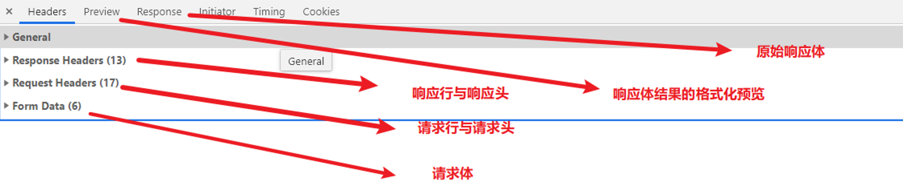

# HTTP 协议

HTTP（hypertext transport protocol）协议也叫 **超文本传输协议**，是一种基于 TCP/IP 的应用层通信协议，这个协议详细规定了浏览器和万维网服务器之间互相通信的规则。

协议主要规定了两方面的内容

* 客户端向服务器发送数据，称之为 **请求报文**
* 服务器向客户端返回数据，称之为 **响应报文**

## Fiddle 工具

Fiddler 是一个http协议调试代理工具，使用它我们可以抓取网页的所有请求与响应，也就是咱们俗称的抓包。


进入软件之后-> tools -> options -> https -> 勾选左侧两个选项框 -> 弹出的窗口中 点击 『是』

## 内容

### 请求

HTTP 请求报文包括四部分

* 请求行
* 请求头
* 空行
* 请求体

```http request
GET http://localhost:3000/index.html?username=sunwukong&password=123123 HTTP/1.1
Host: localhost:3000
Connection: keep-alive
Pragma: no-cache
Cache-Control: no-cache
Upgrade-Insecure-Requests: 1
User-Agent: Mozilla/5.0 (Windows NT 10.0; WOW64) AppleWebKit/537.36 (KHTML, like Gecko) Chrome/64.0.3282.140 Safari/537.36
Accept: text/html,application/xhtml+xml,application/xml;q=0.9,image/webp,image/apng,*/*;q=0.8
Accept-Encoding: gzip, deflate, br
Accept-Language: zh-CN,zh;q=0.9
```

* `GET http://localhost:3000/hello.html HTTP/1.1`：GET请求，请求服务器路径为http://localhost:
  3000/hello.html，?后面跟着的是请求参数（查询字符串），协议是HTTP 1.1版本
* `Host: localhost:3000`：请求的主机名为localhost，端口号3000
* `Connection: keep-alive`：处理完这次请求后继续保持连接，默认为3000ms
* `Pragma: no-cache`：不缓存该资源，http 1.0的规定
* `Cache-Control: no-cache`： 不缓存该资源 http 1.1的规定，优先级更高
* `Upgrade-Insecure-Requests: 1`：告诉服务器，支持发请求的时候不用 http 而用 https
* `User-Agent: Mozilla/5.0 (...`：与浏览器和OS相关的信息。有些网站会显示用户的系统版本和浏览器版本信息，这都是通过获取User-Agent头信息而来的
* `Accept: text/html,...`：告诉服务器，当前客户端可以接收的文档类型。q 相当于描述了客户端对于某种媒体类型的喜好系数，该值的范围是 0-1。默认为1
* `Accept-Encoding: gzip, deflate, br`：支持的压缩格式。数据在网络上传递时，服务器会把数据压缩后再发送
* `Accept-Language: zh-CN,zh;q=0.9`：当前客户端支持的语言，可以在浏览器的工具选项中找到语言相关信息

### 响应

HTTP 响应报文也包括四个部分

- 响应行
- 响应头
- 空行
- 响应体

```http request
HTTP/1.1 200 OK
X-Powered-By: Express
Accept-Ranges: bytes
Cache-Control: public, max-age=0
Last-Modified: Wed, 21 Mar 2018 13:13:13 GMT
ETag: W/"a9-16248b12b64"
Content-Type: text/html; charset=UTF-8
Content-Length: 169
Date: Thu, 22 Mar 2018 12:58:41 GMT
Connection: keep-alive

<!DOCTYPE html>
<html lang="en">
<head>
  <meta charset="UTF-8">
  <title>首页</title>
</head>
<body>
  <h1>网站首页</h1>
</body>
</html>
```

* `HTTP/1.1 200 OK`：协议是HTTP 1.1版本，请求响应成功
* `X-Powered-By: Express`：自定义的头，表示用的框架，一般不返回容易造成安全漏洞。
* `Accept-Ranges: bytes`：告诉浏览器支持多线程下载
* `Cache-Control: public, max-age=0`：强制对所有静态资产进行缓存，即使它通常不可缓存。max-age指定多久缓存一次
* `Last-Modified: Wed, 21 Mar 2018 13:13:13 GMT`：这个资源最后一次被修改的日期和时间
* `ETag: W/"a9-16248b12b64"`：请求资源的标记/ID
* `Content-Type: text/html; charset=UTF-8`：返回响应体资源类型。**设置响应体之后，就不能再设置响应头了**
* `Content-Length: 169`：响应体的长度
* `Date: Thu, 22 Mar 2018 12:58:41 GMT`：提供了日期的时间标志，标明响应报文是什么时间创建的

### WEB 服务

使用 nodejs 创建 HTTP 服务器

```javascript
// 1、引入 http 模块
const http = require('http');
// 2、调用方法，创建服务对象
/*
    request 请求报文的封装对象
    response 响应报文的封装对象
*/
const server = http.createServer(function (request, response) {
    response.end('hello HTTP server');
});
// 3、监听端口，启动服务
/*
    端口号：计算机的服务窗口，总共65536端口
    默认端口 80
    ctrl + c 停止服务
    127.0.0.1 本机的回环地址
*/
server.listen(80, function () {
    console.log('服务已经启动，端口 80 监听中.....');
})
```

- `request` 是对请求报文的封装对象
- `response` 是对响应的封装对象
- 计算的服务窗口 总共 65536 端口 HTTP服务常用端口 8000 3000 9000 8080
- HTTP 默认端口 80
- 获取本机IP：`ipconfig`

#### 获取请求

```javascript
// 引入 http 模块
const http = require('http');
// 一、引入url模块
const url = require('url');
//调用方法，创建服务对象
const server = http.createServer(function (request, response) {
    // 获取请求报文中的内容
    //1、请求的类型
    console.log(request.method);
    //2、请求的url
    console.log(request.url);
    //3、HTTP协议版本
    console.log(request.httpVersion);
    //4、获取url中的路径部分
    //二、调用方法获取参数
    console.log(url.parse(request.url).pathname);
    //5、获取查询字符串
    console.log(url.parse(request.url, true).query);
    //6、获取请求头信息
    console.log(request.headers);
    response.end('HELLO');
});
// 监听端口，启动服务
server.listen(80, function () {
    console.log('服务已经启动，端口 80 监听中.....');
});
```

#### 获取请求体

```javascript
// 引入 http 模块
const http = require('http');
//引入querystring模块
const qs = require('querystring');
// 调用方法，创建服务对象
const server = http.createServer(function (request, response) {
    //提取请求体数据  POST
    //1、声明一个字符串变量
    let body = '';
    //2、绑定data事件
    request.on("data", chunk => {
        //拼接
        body += chunk.toString();
    });
    //3、绑定end事件
    request.on('end', () => {
        console.log(body);
        //调用qs对象的方法
        console.log(qs.parse(body));
        response.end('body server');
    });
});
// 监听端口，启动服务
server.listen(80, function () {
    console.log('服务已经启动，端口 8000 监听中.....');
});
```

#### 设置响应

```javascript
//设置状态码
response.statusCode = 200;

//设置响应头
response.setHeader('content-type', 'text/html;charset-utf-8');

//设置响应体
response.write('body');

//结束
response.end();
```

## GET 和 POST 的区别

GET 和 POST 是 HTTP 协议请求的两种方式

GET 主要用来获取数据, POST 主要用来提交数据

- GET 带参数请求是将参数缀到 URL 之后, 在地址栏输入url访问网站就是 GET 请求, POST 带参数请求是将参数放到请求体中
- POST 请求相对 GET 安全一些, 因为在浏览器中参数会暴露在地址栏.
- GET 请求大小有限制, 一般为 2k, 而 POST 请求则没有大小限制
- GET 类型报文请求方法的位置为 GET , POST 类型报文请求方法为 POST

## Chrome 查看请求报文



## 附录

### 响应状态码

响应状态码是服务器对结果的标识，常见的状态码有以下几种：

- 200：请求成功，浏览器会把响应体内容（通常是html）显示在浏览器中；
- 301：重定向，被请求的旧资源永久移除了（不可以访问了），将会跳转到一个新资源，搜索引擎在抓取新内容的同时也将旧的网址替换为重定向之后的网址；
- 302：重定向，被请求的旧资源还在（还可以访问），但会临时跳转到一个新资源，搜索引擎会抓取新的内容而保存旧的网址
- 304：（Not Modified）请求资源未被修改，浏览器将会读取缓存；
- 403：forbidden 禁止的
- 404：请求的资源没有找到，说明客户端错误的请求了不存在的资源；
- 500：请求资源找到了，但服务器内部出现了错误；

### Sec-Fetch-* 请求头

<https://www.w3.org/TR/fetch-metadata/#sec-fetch-mode-header>
